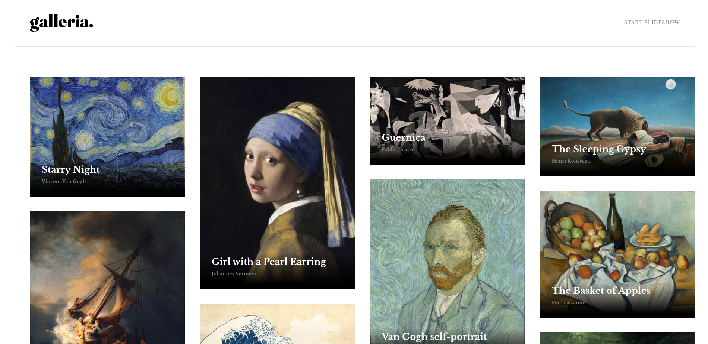

# Frontend Mentor - Galleria slideshow site solution

This is a solution to the [Galleria slideshow site challenge on Frontend Mentor](https://www.frontendmentor.io/challenges/galleria-slideshow-site-tEA4pwsa6). Frontend Mentor challenges help you improve your coding skills by building realistic projects.

## Table of contents

- [Overview](#overview)
  - [The challenge](#the-challenge)
  - [Screenshot](#screenshot)
  - [Links](#links)
- [My process](#my-process)
  - [Built with](#built-with)
- [Author](#author)

## Overview

### The challenge

Users should be able to:

- View the optimal layout for the app depending on their device's screen size
- See hover states for all interactive elements on the page
- Navigate the slideshow and view each painting in a lightbox

### Screenshot

### Links

- Solution URL: [ solution URL ](https://github.com/amiramii/gallery-slideshow-site.git)
- Live Site URL: [ live site URL ](https://amiramii.github.io/gallery-slideshow-site/)

## My process

### Built with

- Semantic HTML5 markup
- TailwindCSS
- JavaScript

## Author

- Frontend Mentor - [@amiramii](https://www.frontendmentor.io/profile/amiramii)